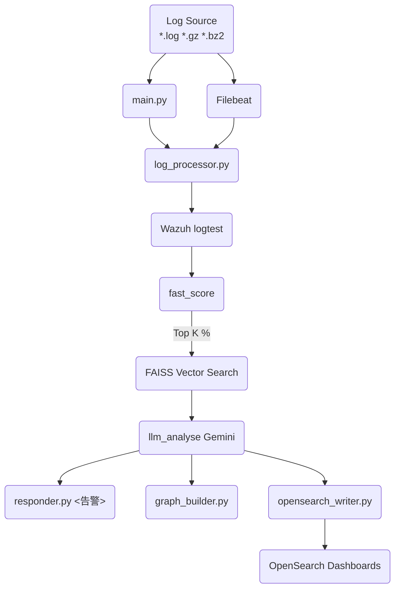

# MS AI 日誌分析與告警系統 (基於 Gemini × LangChain × OpenSearch × Neo4j)

> **版本：v2.4  │  更新日期：2025-06-10**

---

## 概覽與介紹

本系統自動化分析 **`/var/log/LMS_LOG/`** 目錄下的日誌檔案，結合啟發式規則、向量搜尋、Google Gemini 大型語言模型與多種外部服務（OpenSearch、Neo4j、Slack／Teams）來識別潛在攻擊或異常行為，並於偵測到高風險事件時即時告警。

本專案採用 **GraphRAG** 架構：先以向量搜尋檢索歷史案例，再透過 Gemini 產生結構化分析，並把事件實體與關聯寫入 Neo4j 形成知識圖譜，持續累積後續判斷所需的脈絡。

**核心技術**

| 類別     | 技術                                         | 作用                                   |
| ------ | ------------------------------------------ | ------------------------------------ |
| 程式語言   | **Python 3.8+**                            | 核心實作                                 |
| LLM 框架 | **LangChain**                              | 提供 LLM、Agents 與工具鏈整合                 |
| 向量資料庫  | **FAISS‑CPU**                              | 儲存／搜尋日誌向量索引                          |
| 大型語言模型 | **Google Gemini Pro** (`gemini‑2.0‑flash`) | 對可疑日誌進行深度語意分析                        |
| 搜尋與儀表板 | **OpenSearch 2.x + OpenSearch Dashboards** | 儲存分析結果並提供即時視覺化                       |
| 圖形資料庫  | **Neo4j 5.x**                              | 建立威脅知識圖譜 (entities + relations)      |
| 憑證管理   | **HashiCorp Vault**                        | 安全保存 Slack／Teams Webhook 與其他 Secrets |

---

## I. 系統架構（概念流程）



1. **Filebeat 近即時輸入**：監控日誌並寫入 OpenSearch 索引。
2. **FastAPI 服務**：`api_server.py` 暴露 `/analyze/logs` 與 `/investigate` 端點。
3. **批次／串流處理**：`main.py` 透過 `log_processor.process_new_logs()`
   定期從 OpenSearch 抓取尚未分析的日誌並處理。
4. **Wazuh 告警比對**：調用 Wazuh `logtest` 只保留產生告警之行。
5. **啟發式評分**：`fast_score()` 計算危險係數並取前 `SAMPLE_TOP_PERCENT` % 作候選。
6. **向量搜尋 + 圖譜查詢**：句向量嵌入 → `vector_db.py` 搜尋歷史案例，同時透過 `GraphRetrievalTool` 從 Neo4j 取得相關子圖。
7. **Gemini 深度分析（GraphRAG）**：`llm_analyse()` 會結合向量與子圖脈絡，輸出 `is_attack`, `attack_type`, `entities`, `relations` 等結構化 JSON。
8. **結果後處理**：
   * **opensearch_writer.py**：寫入 OpenSearch 供 Dashboards 即時顯示。
   * **responder.py**：向 Slack／Teams 發送告警。
   * **graph_builder.py**：將 `entities` 與 `relations` 建構入 Neo4j。
9. **成本控管**：LRU 快取 + Token Tracker 監控每小時 LLM 花費。
10. **互動式調查**：`/investigate` 端點可查詢向量最相近案例與對應 LLM 輸出。

---

## II. 專案目錄結構

```text
lms_log_analyzer/
├── README.md                    # 本文件
├── docker-compose.yml           # OpenSearch／Neo4j／Vault 範例服務
├── requirements.txt             # 相依套件
├── main.py                      # 批次模式啟動點
├── api_server.py                # FastAPI 入口
├── config.py                    # 設定集中 (可由環境變數覆寫)
├── src/
│   ├── log_processor.py         # 近即時／批次日誌處理核心
│   ├── log_parser.py            # 基本解析 (待增強)
│   ├── llm_handler.py           # 與 Gemini 互動封裝
│   ├── vector_db.py             # 簡易向量搜尋實作 (FAISS 模擬)
│   ├── wazuh_api.py             # Wazuh logtest 呼叫
│   ├── responder.py             # ▶ 進階告警 (Slack／Teams)  ← **新模組**
│   ├── graph_builder.py         # ▶ Neo4j 實體‧關係寫入      ← **新模組**
│   ├── graph_retrieval_tool.py  # ▶ Neo4j 子圖查詢工具        ← **新模組**
│   ├── opensearch_writer.py     # ▶ OpenSearch Exporter       ← **新模組**
│   └── utils.py                 # 共用工具 (HTTP retry、快取…)
├── data/                        # 向量索引、狀態檔、標註資料 (含 `labeled_dataset.jsonl`)
├── logs/                        # 系統運行 Log
└── tests/                       # PyTest 單元／整合測試
```

> **▶** 標示為本次新增／擴充的模組。

---

## III. 安裝與依賴

### 1. 基礎環境

* **作業系統**：Ubuntu 22.04／Rocky Linux 9／macOS 13 以上。Windows 需透過 WSL 或容器。
* **Python**：3.8 或更新版本。
* **Docker + Docker Compose**：用於快速部署 OpenSearch／Neo4j／Vault。

### 2. Python 套件安裝

```bash
python3 -m venv lms_ai_env
source lms_ai_env/bin/activate
pip install -r requirements.txt
```

> 主要依賴：`langchain`, `faiss-cpu`, `sentence-transformers`, `uvicorn`, `fastapi[all]`, `opensearch-py`, `neo4j`, `hvac`…。

### 3. 外部服務安裝

> **所有服務可由 `docker-compose.yml` 一鍵啟動**，以下列出關鍵片段與手動說明。

#### 3‑1 OpenSearch + Dashboards

```yaml
services:
  opensearch:
    image: opensearchproject/opensearch:2.11.0
    environment:
      - discovery.type=single-node
    ports:
      - 9200:9200        # REST API
  dashboards:
    image: opensearchproject/opensearch-dashboards:2.11.0
    environment:
      - OPENSEARCH_HOSTS=["http://opensearch:9200"]
    ports:
      - 5601:5601        # GUI
```

啟動後瀏覽 `http://localhost:5601` 登入 (預設 admin/admin)。

#### 3‑2 Neo4j

```yaml
services:
  neo4j:
    image: neo4j:5.9
    environment:
      - NEO4J_AUTH=neo4j/test1234
    ports:
      - 7474:7474  # HTTP Browser
      - 7687:7687  # Bolt
```

瀏覽 `http://localhost:7474` 以 `neo4j / test1234` 登入。

#### 3‑3 HashiCorp Vault（開發模式）

```yaml
services:
  vault:
    image: hashicorp/vault:1.16
    environment:
      - VAULT_DEV_ROOT_TOKEN_ID=devroot
    ports:
      - 8200:8200
```

啟動後：

```bash
export VAULT_ADDR=http://localhost:8200
export VAULT_TOKEN=devroot

# 寫入 Slack Webhook
vault kv put secret/lms_log_analyzer/slack webhook_url=https://hooks.slack.com/services/AAA/BBB/CCC
```

`responder.py` 於執行時將優先嘗試自 Vault 讀取 Webhook。若無 Vault 設定，則回退至環境變數 `SLACK_WEBHOOK_URL`。

---

## IV. 關鍵模組使用範例

### responder.py – 進階告警

```python
from lms_log_analyzer import responder

responder.send_slack_alert("⚠️ 偵測到 SQL Injection 攻擊！")
responder.send_teams_alert("🚨 多次登入失敗，疑似暴力破解。")
```

### llm_handler.py – Gemini 分析輸出

```python
from lms_log_analyzer import llm_handler

payload = [{"alert": {"original_log": "1.2.3.4 user=alice OR 1=1"}, "examples": []}]
result = llm_handler.llm_analyse(payload)[0]
print(result)
```

### graph_builder.py – 實體／關係寫入 Neo4j

```python
from lms_log_analyzer import graph_builder

gb = graph_builder.GraphBuilder()  # 讀取 NEO4J_URI、NEO4J_USER、NEO4J_PASSWORD

entities = [
    {"id": "ip_1.2.3.4", "label": "IP", "properties": {"address": "1.2.3.4"}},
    {"id": "user_alice", "label": "User", "properties": {"name": "alice"}}
]
relations = [
    {"start_id": "ip_1.2.3.4", "end_id": "user_alice", "type": "ATTACKED"}
]

gb.create_entities(entities)
gb.create_relations(relations)
```
執行後即可在 Neo4j 中看到累積的攻擊事件節點與關係，供後續查詢與視覺化使用。

### graph_retrieval_tool.py – 查詢相關子圖

```python
from lms_log_analyzer import graph_retrieval_tool

tool = graph_retrieval_tool.GraphRetrievalTool()
context = tool.retrieve_for_line("Failed login from 1.2.3.4 user=alice")
print(context)
```
此函式會回傳包含 `nodes` 與 `relationships` 的 dict，可交由 LangChain Agent
作為分析前脈絡。

### opensearch_writer.py – 寫入分析結果

```python
from lms_log_analyzer import opensearch_writer

osw = opensearch_writer.OpenSearchWriter(index_name="lms-log-results")

doc = {
    "timestamp": "2025-06-10T09:00:00Z",
    "level": "HIGH",
    "attack_type": "SQL Injection",
    "message": "Detected suspicious payload 'OR 1=1'",
    "entities": ["ip_1.2.3.4", "user_alice"]
}

osw.index_result(doc)
```

---

## V. 執行方式

```bash
# 啟動外部服務（第一次）
docker-compose up -d

# 啟動 FastAPI 服務（開發模式）
uvicorn api_server:app --reload --port 8000

# 或執行批次分析
python main.py
```

Filebeat 範例：

```yaml
filebeat.inputs:
  - type: log
    paths:
      - /var/log/LMS_LOG/*.log
output.opensearch:
  hosts: ["http://localhost:9200"]
  index: "filebeat"
```

---

## VI. 系統功能里程碑

### 已完成 (✔️)

* 向量搜尋與 FAISS 整合（簡化實作）
* GraphRetrievalTool 提供 Neo4j 子圖查詢
* 壓縮日誌與輪替感知
* LLM 成本快取與批次處理
* 完整單元＋整合測試 & CI/CD

### 部分完成 / 清晰路徑 (⚠️)

* 近即時串流 (Filebeat) – 已能接收，待壓力測試
* Security Hardening – 已使用環境變數，Vault 整合進行中
* python‑grok 強化解析

### 未來擴充 (❌)

* 多工具 Agent（LangChain Tools）
* OpenSearch Dashboards 儀表板模板
* Vault 在生產環境的 ACL 與輪替策略

---

## VII. 常見問題 (FAQ)

| 問題                             | 原因                        | 解法                                             |
| ------------------------------ | ------------------------- | ---------------------------------------------- |
| `ConnectionError: [Errno 111]` | OpenSearch／Neo4j 未啟動或埠未對映 | `docker ps` 確認容器狀態；檢查 `docker-compose.yml` 埠配置 |
| `hvac.exceptions.Forbidden`    | Vault 權杖無權讀取對應路徑          | 確認 `VAULT_TOKEN` 與路徑 ACL                       |
| `401 Unauthorized` (Gemini)    | `GOOGLE_API_KEY`／`GEMINI_API_KEY` 錯誤或權限不足  | 重新申請並匯入環境變數                                    |

## VIII. CI／CD
* **GitHub Actions**：`python.yml` 於 push / PR 觸發單元測試，並 (可選) 自動建置 Docker 映像推送至 GHCR / Docker Hub。
* **GitHub Actions Secrets**：建議將 `GOOGLE_API_KEY`（或 `GEMINI_API_KEY`）、`SLACK_WEBHOOK_URL` 等設定為 Actions Secrets，並於 workflow 內匯入環境。

---

## IX. 貢獻指引

1. Fork → 新分支 → 提交 PR。
2. 所有新增功能請附上對應測試。
3. 保持 README、CHANGELOG 更新。
© 2025 MS AI Log Analyzer Team – Released under MIT License.

└────────────────────┘
     ▼
┌────────────────────┐
│ Gemini LLM (Langchain) │ ← 分析是否為攻擊行為
│ llm_analyse()          │
└────────┬──────────────┘
         │
         ▼
┌────────────────────┐
│ Cache / Token Cost │ ← 避免重複分析 + 成本控制
│ LRUCache / Tracker │
└────────┬────────────┘
         ▼
┌────────────────────┐
│ Exporter            │ ← 將分析結果輸出為 JSON
│ JSON / Log Report   │
└────────────────────┘
